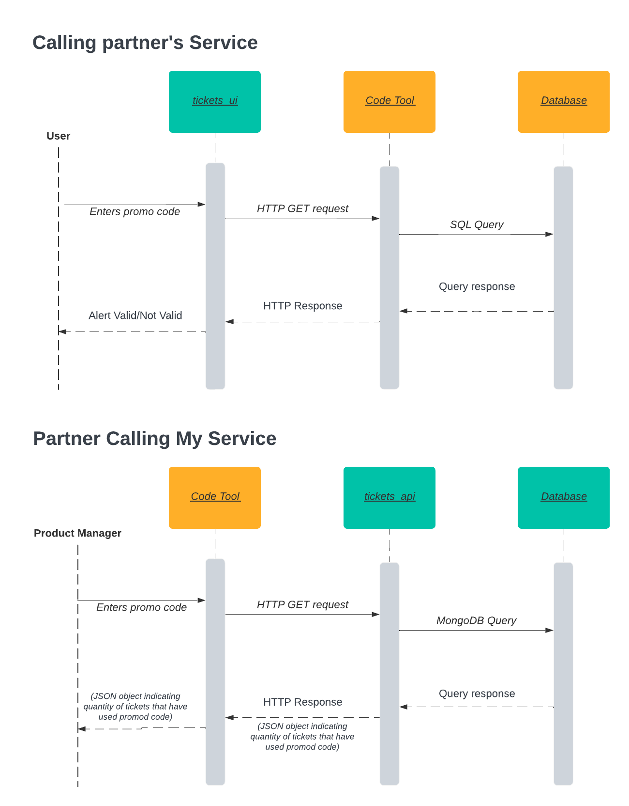

# Tickets
This is a react/node/mongodb application. It consists of a RESTful API and a react GUI.

To deploy locally, clone the repository. Then start the API and the React App in two separate terminals. For example, in one terminal, enter the following commands:

```
cd tickets_api
npm install
npm start
```
In a separate terminal:
```
cd tickets_ui
npm install
npm start
```

## MongoDB set up

Create a database and cluster on mongodb. 

Create a .env file in the `tickets_api` directory and fill it with the following:
```
PORT=3000
MONGODB_CONNECT_STRING=connection string here!
```
Use MongoDB's connection string, replace `username` and `password` with the username and password of your mongodb user.

The API is set up to automatically create a named collection in the database when you use it to "create" a ticket or item. 

In the tickets_api folder, there is a api_tests.http which you can use with postman or the vscode extension "REST Client" to quickly make http requests to the API while it is running. Just make sure at that point the database is up and the API can talk to it with the correct "connect string"

## Authorization/login

## Deploying

## Communication Contract 

The microservice that this application provides is a response to a GET request so partner's code can query my application's database to see if a certain promo code has been used. 

### To call this service:

Send a GET request to the tickets API:

```
GET http://localhost:3000/api/tickets?code={codehere}
```

Replace `{codehere}` with the code that you are searching for. The response (subject to change depending on needs) will be a JSON object with the quantity of tickets specified, for example:

`{"quantity": 1}`

### Requests from this service

This application will send a similar request to my partner's flask application to determine whether or not a promo code is valid:

```
GET http://localhost:5000/code?code={codehere}
```

Replace `{codehere}` with the promo code of which we are determining the validity. 

## Microservices UML


